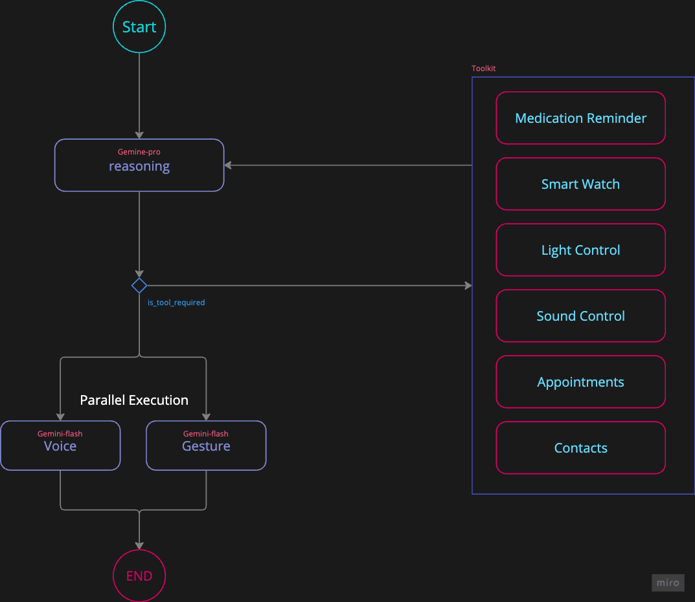

# Skill
The Caregiver Skill for Furhat Robotics is designed to provide empathetic and interactive 
support to individuals in need of assistance, particularly the elderly or those managing 
chronic health conditions.

## How it Works (Server)

### Reasoning and Tools
On the server, a **LangGraph agent** employs the **model for reasoning** 
from the very beginning. It processes the user's event or speech to determine 
the appropriate course of action. Utilizing **Gemini-Pro**, the model 
**iterates over the available tools** until it concludes that the answer is sufficient.

The agent has access to various tools that provide users with critical information, including:

- **Medication Details:** Access to prescribed medications and schedules.
- **Contacts:** Information regarding doctors and family members for quick communication.
- **Home Control:** Management of household features such as sound and lighting.
- **Appointment Verification:** Checking upcoming appointments and reminders.
- **Health Status:** Monitoring and reporting on health-related metrics.

Through this **iterative process**, the agent ensures that users receive **comprehensive and relevant information** tailored to their needs.

### Empathetic Responses (Voice and Gesture)
In addition to providing information, the LangGraph agent is designed to deliver **empathetic responses** that enhance user interaction, creating a **supportive environment**.
In the first step, the answer was generated; now it is taken the answer and adjusting the **voice tone** (supported by **Azure**) and **facial expressions** (supported by **Furhat OS**).

